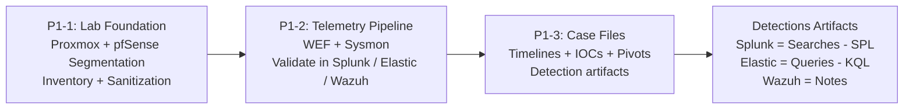

## Hi, I’m Kevin — IT Maintainer for networks and security.

I’m someone who learns by building and maintaining. I built a segmented homelab and a Windows telemetry pipeline, then used that data to practice incident investigations—writing case files with timelines, artifacts/IOCs, and repeatable searches/queries across Splunk, Elastic/Kibana, and Wazuh (See Portfolio 1). I’m strongest in alert triage, log analysis, and communicating technical findings clearly.

---

## Featured Security Projects — Overview
I built a hands-on Blue Team portfolio by designing a segmented lab environment, centralizing endpoint telemetry, and documenting incident-style investigations using real logs.
This portfolio followed a progression:
1) **Lab foundation** (segmentation and inventory)
2) **Telemetry pipeline** (centralized Windows logging and validation)
3) **Incident-style case files** (timelines, artifacts/IOCs, and investigative pivots)

> **Sanitization note:** Public documentation uses representative hostnames/IP ranges and redacts WAN/public IPs, external domains/DDNS, credentials, tokens, and other sensitive identifiers.
---

## Portfolio 1 (P1) — Lab Infrastructure, Telemetry, and Investigation Case Files
**Portfolio Hub:** https://github.com/kvatnynito/Cybersecurity-Portfolio1

### Featured Repositories
- **P1-1: Proxmox Segmentation Lab**  
  I documented a segmented lab blueprint (Proxmox + pfSense), including VM inventory and safe publishing guidelines.  
  https://github.com/kvatnynito/P1-1-proxmox-segmentation-lab

- **P1-2: WEF + Sysmon Telemetry Pipeline (Wazuh / Elastic / Splunk)**  
  I documented a centralized Windows telemetry pipeline (WEF + Sysmon) and built validation steps and reusable artifacts across Wazuh, Elastic, and Splunk.  
  https://github.com/kvatnynito/P1-2-wef-sysmon-to-wazuh-elastic-splunk

- **P1-3: Incident Investigation Case Files**  
  I created incident-style case documentation with supporting artifacts, including:
  - Splunk: searches (SPL)
  - Elastic: queries (KQL)
  - Wazuh: investigation notes / alert references  
  https://github.com/kvatnynito/P1-3-incident-investigation-casefiles
